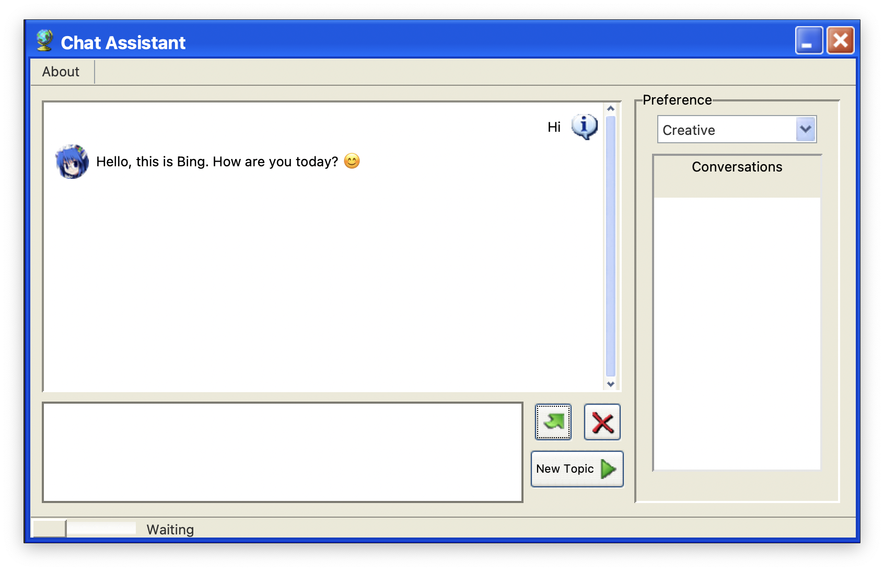

<div align="center">

# Bing AI 2000s

[comment]: <> ()
[comment]: <> (<br>)


*So cool!*

</div>
<br>

### How to use

Download source code and unzip
```shell
wget https://github.com/SteelDrEgg/2000sBingAI/archive/refs/heads/master.zip
unzip master.zip
```

cd into directory then download dependencies
```shell
pip3 install -r requirements.txt
```

Run
```shell
python3 main.py
```

### Why I do this?

It's so cool if we have super AI in 2000s!

I'll call it the **Millenniumtechpunk**, which is the combination of Millennium Tech and Punk.

Disclaimer:
- Just for fun
- No offensive
- No further plan on maintaining (unless it become popular)
